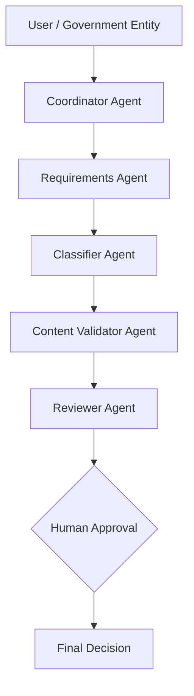
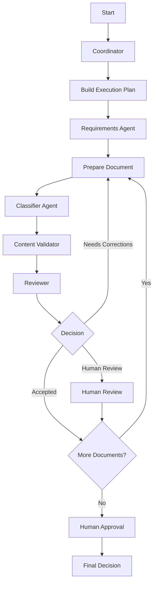

# Multi-Agent Document Auditor for National Data Index

## Project Overview

### English
This project is a Multi-Agent AI system designed to assist government entities in reviewing supporting documents submitted for the **National Data Index (Nadhee)**. The system uses multiple specialized agents to determine required documents, classify uploaded files, validate their content, and review the final results before human approval. The main goal is to reduce manual effort, improve document validation accuracy, and provide a structured review process.

### العربية
هذا المشروع عبارة عن نظام ذكاء اصطناعي متعدد الوكلاء (Multi-Agent AI System) يهدف إلى مساعدة الجهات الحكومية في مراجعة الوثائق الداعمة المقدمة ضمن **المؤشر الوطني للبيانات (نضيء)**. يستخدم النظام عدة وكلاء متخصصين لتحديد الوثائق المطلوبة، وتصنيف الملفات المرفوعة، والتحقق من محتواها، ومراجعة النتائج قبل اعتمادها من قبل المراجع البشري. يهدف النظام إلى تقليل الجهد اليدوي، وتحسين دقة التحقق من الوثائق، وتوفير عملية مراجعة منظمة.

---

## Project Structure

```text
project/
│
├── agents/
│   ├── coordinator_agent.py
│   ├── requirements_agent.py
│   ├── classifier_agent.py
│   ├── content_validator_agent.py
│   └── reviewer_agent.py
│
├── tools/
│   ├── file_reader.py
│   ├── rag_retriever.py
│   ├── pii_masker.py
│   ├── validation_tools.py
│   └── monitoring.py
│
├── security/
│   ├── input_validation.py
│   ├── prompt_injection.py
│   ├── rbac.py
│   └── output_filter.py
│
├── knowledge_base/
│   ├── raw/
│   └── vector_store/
│
├── logs/
├── tests/
├── workflow_graph.py
├── main.py
├── requirements.txt
├── .env.example
└── README.md
```

---

## Architecture Diagram



---

## Workflow Diagram & Explanation



The workflow follows a sequential multi-agent process:
- The system routes documents through specialized agents for planning, requirement retrieval, classification, content validation, and review.
- Documents that fail validation can be routed back for correction and re-upload.
- Ambiguous or failing documents can be escalated to human review.
- The final package requires explicit human approval before a final decision is made.

---

## Agents and Their Roles

### 1. Coordinator Agent
- Receives the domain, criterion, and claimed maturity level.
- Builds the execution plan.
- Coordinates the other agents.
- Manages the overall workflow.

### 2. Requirements Agent
- Determines the required supporting documents.
- Considers cumulative maturity levels.
- Retrieves relevant requirements from the Nadhee Knowledge Base using RAG.

### 3. Classifier Agent
- Validates the uploaded file.
- Checks filename format and reference code.
- Checks supported file type and size.
- Matches the document with the required document list.

### 4. Content Validator Agent
- Reads the document content.
- Retrieves relevant acceptance criteria.
- Checks whether required elements are present.
- Identifies missing or ambiguous requirements.

### 5. Reviewer Agent
- Reviews the previous agent results.
- Performs reflection and self-critique.
- Identifies inconsistencies or missing evidence.
- Determines whether human review or corrections are required.

---

## Technologies & AI Tools Used

- **Python 3.11+**
- **LangGraph**
- **LangChain**
- **Groq LLM**
- **Retrieval-Augmented Generation (RAG)**
- **Chroma Vector Database**
- **Sentence Transformers**
- **PyPDF**
- **python-docx**
- **Pydantic**
- **pytest**

---

## Installation and Setup Instructions

### 1. Install Dependencies
```bash
pip install -r requirements.txt
```

### 2. Configure Environment Variables
Create a `.env` file based on `.env.example`:
```ini
GROQ_API_KEY=your_api_key
```

### 3. Prepare the Knowledge Base
Place the official Nadhee reference document inside:
```bash
knowledge_base/raw/
```

Run the knowledge base ingestion process before running the system:
```bash
python knowledge_base/ingestion.py
```

---

## How to Run the Project

Run the main application:
```bash
python main.py
```

The application demonstrates the complete multi-agent workflow, including document classification, content validation, review, and human approval.

---

## Testing

Run all tests using:
```bash
pytest -q
```

The test suite covers:
- **Normal workflow:** Valid document package and successful validation.
- **Invalid input:** Unsupported file types and malformed file names.
- **Validation failure:** Missing required content or criteria.
- **Cumulative maturity requirements:** Lower-level requirements verified for higher claimed levels.
- **Prompt injection detection:** Adversarial instructions detected and safely handled.

---

## Future Improvements

- True parallel document processing using LangGraph fan-out/fan-in.
- More advanced document requirement extraction.
- Additional document security and file signature validation.
- Improved monitoring and analytics.
- Integration with official submission systems.

---

## SDAIA Academy

- Repository: [https://github.com/SDAIAAcademy](https://github.com/SDAIAAcademy)
